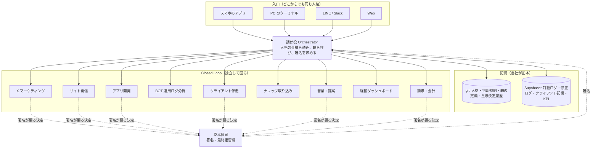

# 運用モデル: 一つの実行主体、複数の Closed Loop

> 「Grok Bot を使う」構想の設計書。SNS マーケティングからアプリ開発、ログ分析までの運用全体を、
> 一つのクラウドエージェント（実行主体）に内包させる。ただし実行主体が一つであることと、ベンダーが一つであることは別。
> 根拠は夏本健司『Closed Loop と「学習する AI 組織」』の原則、「AI 人格は分けろ、実行主体は分けるな、Closed Loop は分けろ」。

## 要件（夏本本人の言葉から）

1. **運用全体を一つのエージェントに内包する**。SNS、開発、ログ分析が別々の道具に散らばらない。
2. **ローカルとクラウドを一つの人格で通す**。PC のターミナルから話しても、スマホのアプリから話しても、同じ人格、同じ記憶、同じ判断規則で応答する。
3. **いつでもどこからでもアクセスできる**。スマホ、PC、外出先。
4. **ローカルにコピーを置ける**。クラウドが止まっても、記憶と規則は手元にある。

## 設計原則

| 原則 | 内容 | 根拠 |
|---|---|---|
| 実行主体は一つ | 調停役（Orchestrator）は一つ。各 Closed Loop はその下で独立に回る | Closed Loop 論文 |
| 人格は一つ、入口は複数 | 人格の仕様（システムプロンプト、判断規則）は git の一箇所。スマホ、PC、LINE、Web はすべて同じ仕様を読む入口にすぎない | 要件 2、3 |
| 記憶は自社に置く | 意思決定履歴、対話ログ、修正ログ、プロンプトは git と Supabase が正本。エージェント側にあるのは写し | 同論文「モデル切替に耐える長期記憶を AI 組織側に蓄積する」、要件 4 |
| 実行役は輪ごとに選ぶ | X の輪は Grok の優位が大きい。開発の輪は現状 Claude Code。ログ分析はどちらでも。輪ごとに採点して決める | 機能ごとの適性 |
| 鍵は輪ごとに分ける | 一つの輪の鍵が漏れても、他の輪に及ばない。権限は最小 | 被害範囲の限定 |
| 機密は輪をまたがない | クライアントの対話ログは製品の輪に閉じる。SNS の輪には流さない | クライアント保護 |
| 署名は人が固定する | 公開投稿、本番反映、送付、課金は夏本本人が署名してから実行。署名は意思決定を不可逆に固定する行為 | 意思決定生成企業の論文 |
| 輪は git のフォルダで定義する | 各輪は `bot/ops/loops/<名前>/` に、目的、プロンプト、頻度、鍵の範囲、署名方針を持つ。実行役が変わっても定義は変わらない | 要件 4 |

## 構造



「一つの人格で通す」を成立させる条件は、人格と記憶がどのベンダーのアプリの中にもないことである。
Grok のアプリから話しても Claude Code から話しても、両方が同じ `bot/prompts/` と同じ Supabase を読むから同じ人格になる。
逆に、人格や記憶を特定ベンダーのエージェントの内部に置くと、入口がそのベンダーに固定され、要件 2 と 4 が崩れる。

## 立ち上げ順序

| 順 | 輪 | 時期 | 理由 |
|---|---|---|---|
| 1 | アプリ開発 | 稼働中 | この設計資産自体が、この輪の成果物 |
| 2 | X マーケティング | MVP と並行（今週） | 結果が数字で見え、機密を含まない。Grok を実行役として試す最初の輪に向く |
| 3 | BOT 運用ログ分析 | 3 日目以降 | 採点ログが溜まり始めたら回す。修正率の低下が BOT の成長指標 |
| 4 | ナレッジ取り込み | 第 1〜2 週 | 公開サイト、SpeakerDeck、Drive、Miro、YouTube の順 |
| 5 | クライアント伴走 | 第 5 週以降 | クライアント別ワークスペースと認証ができてから |
| 6 | サイト発信 | 第 3 週以降 | 論文とニュースの公開を輪にする |
| 7 | 営業・提案 | 第 6 週以降 | 提案書の型（三案比較）が取り込まれてから |
| 8 | 経営ダッシュボード | 第 8 週以降 | 署名ログと KPI が揃ってから。90 日の問い直しを含む |
| 9 | 請求・会計 | 第 8 週以降 | 見積と請求の型は Drive にある |

## 輪の定義書式（各 `loops/<名前>/loop.md`）

```
# <輪の名前>
- 目的:
- 入力:
- 出力:
- 頻度:
- 実行役: 第一候補 / 代替
- 鍵の範囲: （この輪だけが持つ鍵）
- 機密区分: なし / 社内 / クライアント
- 署名が要る判断:
- 成果指標:
- プロンプト: prompt.md
- 停止条件: （この条件で自動停止し、夏本に通知する）
```

一覧は `closed-loops.md`。
